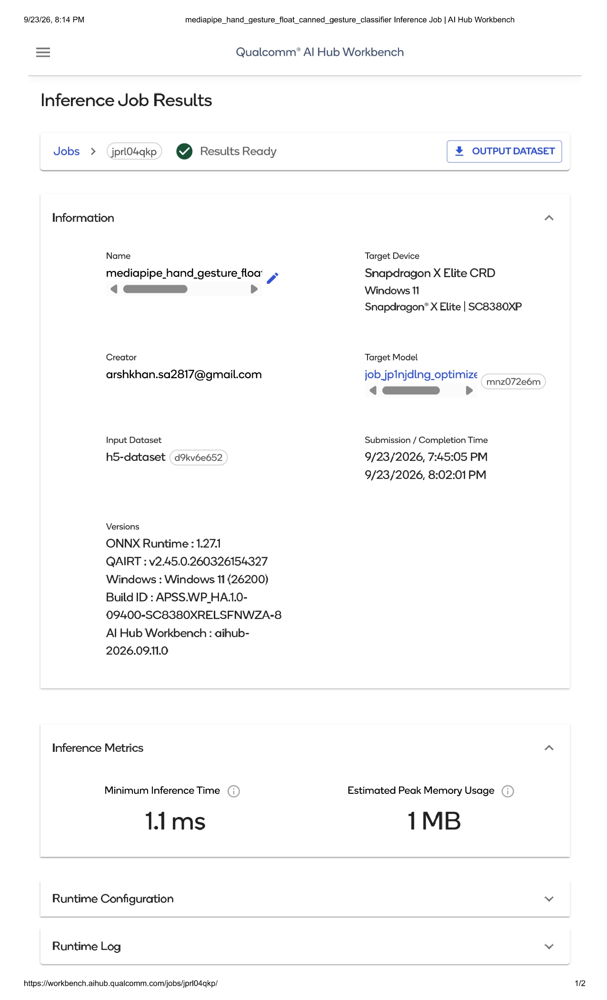
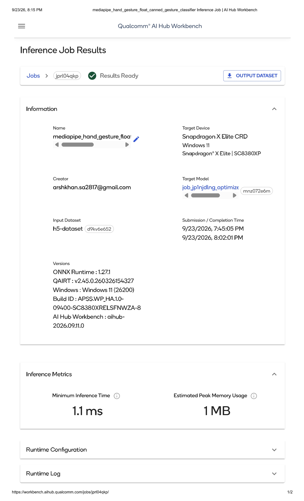

# Touchless Laptop Control

Gesture-controlled media playback + presence-based auto-lock, built for
Snapdragon-powered HP laptops.

Submitted for the **Snapdragon AI Lab Build & Present Challenge**.

## What it does

- Control media playback (play, pause, volume up/down) using hand
  gestures in front of your webcam — no touch required.
- Automatically locks your screen if you step away and no face is
  detected for a configurable timeout (privacy/productivity feature).
- Runs **entirely on-device**: no camera frame is ever sent to the
  cloud.

## Gesture -> Action

| Gesture       | Action       |
|---------------|--------------|
| Open Palm ✋   | Play         |
| Closed Fist ✊ | Pause        |
| Thumb Up 👍   | Volume Up    |
| Thumb Down 👎 | Volume Down  |
| No face for 30s | Lock screen |

## Why Snapdragon

Both models are pre-optimized by Qualcomm and officially validated on
**Snapdragon X Elite** and **Snapdragon X Plus** — the chips inside
Snapdragon-powered HP laptops — per
[Qualcomm AI Hub](https://aihub.qualcomm.com):

- `MediaPipe-Hand-Gesture-Recognition` — hand detection, 21-point hand
  landmarks, and gesture classification in one lightweight pipeline.
- `MediaPipe-Face-Detection` — sub-millisecond face detection, used
  here purely for presence, not identity/authentication.

Published Qualcomm benchmarks on comparable Snapdragon NPU hardware
show inference times in the range of ~100-350 microseconds and peak
memory under 30 MB per model — well within real-time budgets for a
laptop webcam.

## Why not face-unlock?

Secure biometric login is already solved by Windows Hello (with
IR-camera spoof protection). Rebuilding that ourselves in a hackathon
timeframe would be both hard to get right and easy to break. Instead,
this project uses face **presence** only, for a privacy feature
(auto-lock when you leave), while all actual authentication stays with
Windows as normal.

## Setup

Requires Python 3.9-3.12 (tested on 3.11).

```bash
pip install qai_hub_models keyboard opencv-python
```

## Run

```bash
python gesture_media_control.py
```

A window will open showing your webcam feed with the currently
detected gesture and face-presence status overlaid. Press `q` to quit.

## Architecture

```
Webcam frame
    |
    +--> MediaPipe-Hand-Gesture-Recognition --> gesture label --> OS media key press
    |
    +--> MediaPipe-Face-Detection --> face present? --> auto-lock timer
```

Both models run on the same captured frame each loop iteration.
Gesture triggers are debounced (must be held for a few consecutive
frames) and rate-limited (cooldown between repeated triggers) to avoid
false positives.

## Screenshots





## Limitations / future work

- Gesture set is limited to MediaPipe's built-in canned gestures
  (Open_Palm, Closed_Fist, Thumb_Up, Thumb_Down, Pointing_Up, Victory,
  ILoveYou); custom gestures would need a custom-trained classifier.
- Currently tested via CPU/GPU inference on a development laptop;
  on-device NPU profiling was validated separately through Qualcomm AI
  Hub's cloud-hosted Snapdragon X Elite device.
- Single-hand gesture handling; multi-hand disambiguation is a
  possible extension.

## Models

- [MediaPipe-Hand-Gesture-Recognition on Qualcomm AI Hub](https://aihub.qualcomm.com/models/mediapipe_hand_gesture)
- [MediaPipe-Face-Detection on Qualcomm AI Hub](https://aihub.qualcomm.com/models/mediapipe_face)
